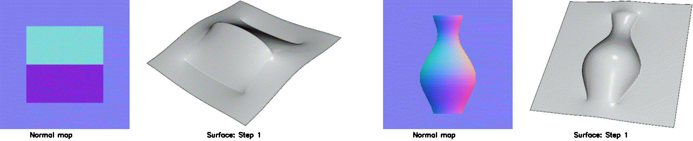
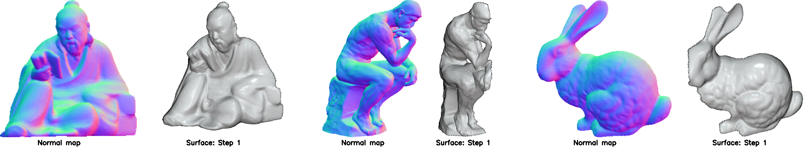

# [Bilateral Normal Integration](https://drive.google.com/file/d/17eB96Yr40wouCacoLMpQdfXgQ5PEDgkT/view?usp=sharing)

[Xu Cao](https://hoshino042.github.io/homepage/), [Hiroaki Santo](https://sites.google.com/view/hiroaki-santo/), [Boxin Shi](http://alumni.media.mit.edu/~shiboxin/), [Fumio Okura](http://cvl.ist.osaka-u.ac.jp/user/okura/) and [Yasuyuki Matsushita](http://www-infobiz.ist.osaka-u.ac.jp/en/member/matsushita/)

ECCV 2022

This is the official Python implementation of the ECCV 2022 work "Bilateral Normal Integration" (BiNI). 
We propose a variational approach for **discontinuity preserving** surface reconstruction from a surface normal map.
Our method can handle both orthographic and perspective projection, is robust to outliers, and only has one hyperparameter in the objective function.

## Reconstruction results
### Classical toy normal maps
The left one is "tent," and the right one is "vase."
<p align="center">
    
</p>

### Synthetic normal maps
Normal maps rendered by Mitsuba 0.6. The left one is rendered by an orthographic camera, and the right two are by a perspective camera.
<p align="center">
    
</p>

### Real-world normal maps
From left to right in the following, we show reconstruction results from the real-world normal maps estimated by [CNN-PS](https://github.com/satoshi-ikehata/CNN-PS-ECCV2018), [deep polarization 3D imaging](https://wp.doc.ic.ac.uk/rgi/project/deep-polarization-3d-imaging/), and [ICON](https://icon.is.tue.mpg.de), respectively.
<p align="center">
    
</p>

### DiLiGenT normal maps
The following perspective normal maps are from [DiLiGenT](https://sites.google.com/site/photometricstereodata/single?authuser=0) dataset.
<p align="center">
    
</p>

## Dependencies
Our implementation was tested using Python 3.7 and depends on `Numpy` and `Scipy` for numerical computation, `PyVista` for mesh IO, and `OpenCV` for image IO.
You can ensure the four packages are installed in your python environment by running:

 ```
pip install -r requirements.txt
 ```

## Reproduce our results 
The `data` folder contains all surfaces we used in the paper.
Each normal map and its mask are put in a distinct folder.
For the normal map in the perspective case, its folder contains an extra `K.txt` recording the 3x3 camera intrinsic matrix.
Our code determines the perspective or orthographic case based on whether or not there is a `K.txt` in the normal map's folder.

To obtain the integrated surface  of a specific normal map, pass the normal map's folder path to the script `bilateral_normal_integration.py`.
For example, 
```
python bilateral_normal_integration.py --path data/Fig4_reading
```
This script will save the integrated surface and discontinuity maps in the same folder.
The default parameter setting is `k=2` (the sigmoid function's sharpness), `iter=100` (the maximum iteration number of IRLS), 
and `tol=1e-5` (the stopping tolerance of IRLS).
You can change the parameter settings by running, for example, 
```
python bilateral_normal_integration.py --path data/supp_vase -k 4 --iter 100 --tol 1e-5
```
In our experiments, `tol` is consistently set as 1e-5.
For `k` and `iter`, we used the following setups:

| surfaces                    | k   | iter |
|-----------------------------|-----|------|
| Fig. 1 the thinker          | 2   | 100  |
| Fig. 4 stripes              | 2   | 100  |
| Fig. 4 reading              | 2   | 100  |
| Fig. 5 plant                | 2   | 150  |
| Fig. 5 owl                  | 2   | 100  |
| Fig. 5 human                | 2   | 100  |
| Fig. 6 bunny                | 2   | 100  |
| Fig. 7 all DiLiGenT objects | 2   | 100  |
| supp vase                   | 4   | 100  |
| supp tent                   | 1   | 100  |
| supp limitation2            | 4   | 100  |
| supp limitation3            | 2   | 300  |


## Run on your normal maps
You can test our method using your normal maps.
Put the following in the same folder, and pass the folder path to the script, as abovementioned.

- `"normal_map.png"`: The RGB color-coded normal map. Check main paper's Fig. 1(a) for the coordinate system. 
We recommend saving the normal maps as 16-bit images to reduce the discretization error.
- `"mask.png"`: The integration domain should be white (1.0 or 255); the background should be black (0).
- `"K.txt"` (perspective case): the (3, 3) camera intrinsic matrix. We used `np.savetxt("K.txt", K)` to save the camera matrix into the txt file.

Reading the normal map from an RGB image inevitably introduces discretization errors, e.g., 
the n_x continuously defined in [-1, 1] can only take 256 or 65536 possible values in an 8-bit or 16-bit image, respectively.
If you want to avoid such error, you can directly call the function ``bilateral_normal_integration()`` in your code by

```
depth_map, surface, wu_map, wv_map, energy_list = bilateral_normal_integration(normal_map, mask, k=2, K=None, max_iter=100, tol=1e-5)
```
The key hyperparameter here is the small `k`. It controls how easily the discontinuity can be preserved.
The larger `k` is, discontinuities are easier to be preserved.
However, a very large `k` may introduce artifacts around discontinuities and over-segment the surface,
while a tiny `k` can result in smooth surfaces.
We recommend set `k=2` initially, and tune it depending on your results.

## Depth normal fusion
Our ECCV paper does not discribe how to use the information from a prior depth map if it is available.
We present the code here because there are people asking for this feature.
Suppose you have a prior depth map recording coarse geometry information, and you want to fuse the coarse depth map with the normal map with fine geometry details.
You can call our function in your code in this way:
```
depth_map, surface, wu_map, wv_map, energy_list = bilateral_normal_integration(normal_map, 
                                                                               normal_mask, 
                                                                               k=2, 
                                                                               depth_map=depth_map,
                                                                               depth_mask=depth_mask,
                                                                               lambda1=1e-4,
                                                                               K=None)
```
The depth mask here need not be identical to the normal mask. That is, the prior depth map can be either sparse or dense,
depending on your application.
The refined depth map will have the same domain as the normal map.
A new hyperparameter lambda1 is introduced to control the effect of the prior depth map.
The larger lambda1 is, the resultant depth map will appear closer to the prior depth map.
Depth normal fusion also works in both orthographic and perspective cases.

## Citation
If you find our work useful in your research, please consider citing:
```
@inproceedings{xu2022bilateral,
  title={Bilateral Normal Integration},
  author={Cao, Xu and Santo, Hiroaki and Shi, Boxin and Okura, Fumio and Matsushita, Yasuyuki},
  booktitle={European conference on computer vision (ECCV)},
  pages={},
  year={2022}
}
```